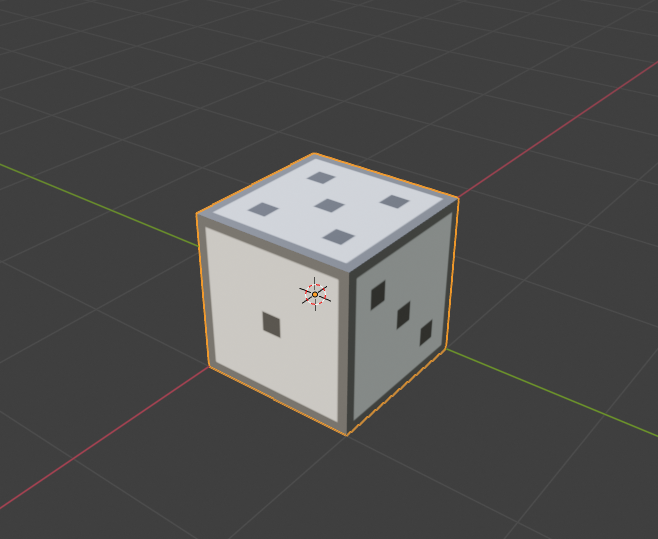

# 3d Cubes

A simple cube in various file formats. Each file contains comments describing the data.
Files were tested by importing into Blender 2.8.

# Cubes

## Wavefront .obj

[cube.obj](cube.obj), [cube-tex.obj](cube-tex.obj)

The Wavefront .obj file format supports vertices, normals and texture coordinates
(and more advanced features not used here).

[cube.obj](cube.obj) is a basic cube with no texture.

[cube-tex.obj](cube-tex.obj) is a basic cube with a texture material.
Material info is stored in a separate .mtl file: [cube.mtl](cube.mtl)

## STL

[cube.stl](cube.stl)

STL files only store vertices and normals.

## Collada

[cube.dae](cube.dae),  [cube-tex.dae](cube-tex.dae),  [cube-tex2.dae](cube-tex2.dae)

Collada files can store entire scenes and animations and provide many ways of specifying the data.

In [cube.dae](cube.dae), the vertex and normal arrays are aligned and are both the same length.
This allows the same index to be used for each array when defining triangles, but it also
means that some of the vertex, normal and uv data needs to be duplicated.

In [cube-tex.dae](cube-tex.dae), the arrays are in parallel like cube.dae, but this version adds
a uv array and a texture reference.

In [cube-tex2.dae](cube-tex2.dae), each vertex, normal and uv value is stored only once.
But this means that when defining triangles, a separate index needs to be provided for each array.

# Textures

The following texture is used to map the cubes.

